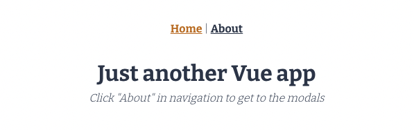
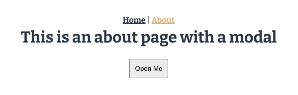
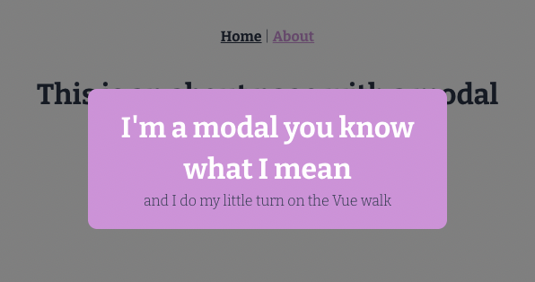
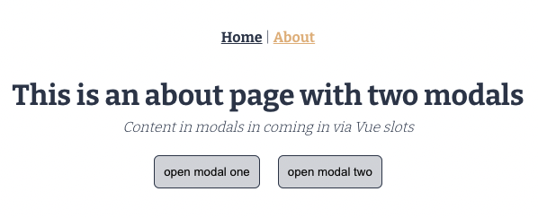
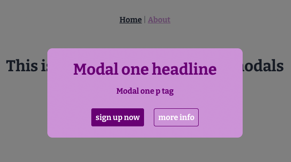
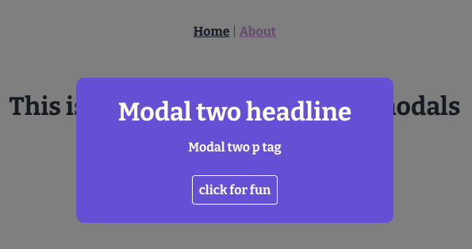

# Vue 3 CLI - One / Two Modals

## What is this about?
- a very simple Vue 3 CLI set-up with a very simple navigation (router-link)
- a very simple modal on the "about" page
- this project is only for set-up practicing purposes and only has the bare minimum regarding styling

## Branches
- please see `main` for the very simple modal

- please see `slots` for two modals coming in via slots

## Tech Stack
- Vue 3
- HTML, SCSS, JavaScript

## Source
- [The Net Ninja - Vue JS 3 Tutorial for Beginners #4 - The Vue CLI & Bigger Projects (part 1)](https://www.youtube.com/watch?v=GWRvrSqnFbM&list=PL4cUxeGkcC9hYYGbV60Vq3IXYNfDk8At1&index=4)
- [The Net Ninja - Vue JS 3 Tutorial for Beginners #5 - The Vue CLI & Bigger Projects (part 2)](https://www.youtube.com/watch?v=KM1U6DqZf8M&list=PL4cUxeGkcC9hYYGbV60Vq3IXYNfDk8At1&index=5)
- [GitHub - result Branch](https://github.com/iamshaunjp/Vue-3-Firebase/tree/lesson-30)

## How to run this?
- clone the repo
- cd into project
- `npm install` to prepare the project setup
- `npm run serve` to compile and hot-reaload for development, this will generally fire up the server at http://localhost:8080/ (or the next availble number)
- `npm run build` to compile and minify for production
- `npm run lint` to lint and fix files
- `control c` to properly stop the server

### Customize configuration
See [Configuration Reference](https://cli.vuejs.org/config/).
